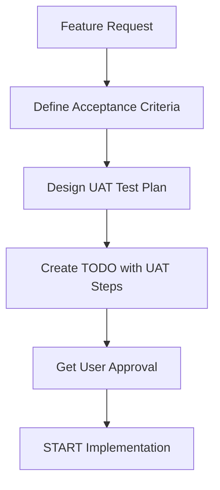

# Feature Implementation with User Acceptance Testing (UAT)

> 📋 **Methodology Document** | [Home](../README.md) > [CLAUDE.md](../CLAUDE.md) > **UAT Methodology**

**Version:** 1.0
**Status:** Active
**Last Updated:** 2025-12-26

---

## 🎯 Purpose

This document defines the **mandatory methodology** for implementing features with integrated User Acceptance Testing (UAT). All feature development MUST follow this process to ensure production readiness.

**Core Principle:** *"Test Plan First, Code Second, User Validation Always"*

---

## 📊 Test Pyramid - Complete Coverage Required

```
         /\
        /  \      ← UAT Tests (User Interactive) [MANDATORY]
       /    \       - ONE-AT-A-TIME format
      /------\      - User executes, AI validates
     /        \     - Real environment only
    /  E2E     \  ← End-to-End Tests (Real System)
   /   Tests    \   - Full integration
  /--------------\  - Real Docker containers
 /  Integration   \ - Real Claude Code
/      Tests       \- Real data persistence
-------------------
/   Unit Tests      \ ← Automated Tests
---------------------  - Function logic
                       - Script behavior
                       - --dry-run acceptable
```

### Critical Understanding

**What we learned from P1 incident:**
- ✅ Unit tests with `--dry-run` verified script logic
- ❌ But `--dry-run` **NEVER launched Docker container**
- ❌ Claude Code was **NEVER actually tested**
- ❌ Volume mapping was **NEVER verified**
- ❌ Data persistence was **NEVER checked**

**Conclusion:** Without UAT, we cannot guarantee the feature works in production!

---

## 🔄 Feature Implementation Workflow

### Phase 1: Planning (BEFORE coding)



#### 1.1 Define Acceptance Criteria

**Template:**
```markdown
## Feature: [Feature Name]

### User Story
As a [user type], I want [goal] so that [benefit].

### Acceptance Criteria
- [ ] Criterion 1: Specific, measurable outcome
- [ ] Criterion 2: Specific, measurable outcome
- [ ] Criterion 3: Specific, measurable outcome

### Success Metrics
- Metric 1: [How to measure]
- Metric 2: [How to measure]

### Edge Cases
1. Edge case 1 → Expected behavior
2. Edge case 2 → Expected behavior
```

#### 1.2 Design UAT Test Plan

**MANDATORY:** UAT plan MUST be created BEFORE writing code!

**Template:**
```markdown
## UAT Test Plan: [Feature Name]

### Test Environment
- OS: [macOS/Linux/Windows]
- Docker: [version]
- Shell: [bash/zsh]

### Prerequisites
- [ ] Prerequisite 1
- [ ] Prerequisite 2

### Test Scenarios

#### Scenario 1: [Happy Path]
**Objective:** Verify [what]
**Steps:**
1. [User action 1]
2. [User action 2]
**Expected Result:** [What should happen]
**Validation:** [How to verify]

#### Scenario 2: [Error Handling]
**Objective:** Verify [what]
**Steps:**
1. [User action 1]
2. [User action 2]
**Expected Result:** [What should happen]
**Validation:** [How to verify]

#### Scenario 3: [Edge Case]
**Objective:** Verify [what]
**Steps:**
1. [User action 1]
2. [User action 2]
**Expected Result:** [What should happen]
**Validation:** [How to verify]
```

#### 1.3 Create TODO with Integrated UAT

**Template:**
```json
{
  "feature": "P1: Automatic Docker Image Build",
  "status": "planning",
  "tasks": [
    {
      "type": "implementation",
      "task": "Add ensure_image() function",
      "status": "pending"
    },
    {
      "type": "unit_test",
      "task": "Test ensure_image() logic with --dry-run",
      "status": "pending"
    },
    {
      "type": "integration_test",
      "task": "Test real Docker build (without dry-run)",
      "status": "pending"
    },
    {
      "type": "uat",
      "task": "UAT Step 1: Auto-build when image missing",
      "status": "pending",
      "requires_user": true
    },
    {
      "type": "uat",
      "task": "UAT Step 2: No rebuild when image exists",
      "status": "pending",
      "requires_user": true
    },
    {
      "type": "uat",
      "task": "UAT Step 3: Real Claude Code launch",
      "status": "pending",
      "requires_user": true
    },
    {
      "type": "documentation",
      "task": "Update docs with new feature",
      "status": "pending"
    },
    {
      "type": "commit",
      "task": "Create commit with test results",
      "status": "pending"
    }
  ],
  "definition_of_done": {
    "code_complete": false,
    "unit_tests_passed": false,
    "integration_tests_passed": false,
    "uat_completed": false,
    "user_approved": false,
    "docs_updated": false,
    "committed": false
  }
}
```

---

## 🧪 UAT Execution Protocol

### ONE-AT-A-TIME Format (MANDATORY)

**Rules:**
1. AI provides ONE step at a time
2. User executes in separate terminal
3. User copies FULL output
4. User sends result to AI
5. AI validates before next step
6. NEVER proceed without user confirmation

### UAT Step Template

```markdown
# 🎯 UAT Step [N]: [Test Name]

## Context
[Brief explanation of what this step tests and why it matters]

## Prerequisites
- [ ] Prerequisite 1
- [ ] Prerequisite 2

## Command to Execute

**Open a NEW terminal window** and run:
```bash
[exact command here]
```

## What This Command Does
1. Action 1
2. Action 2
3. Action 3

## Expected Output
```
[Show expected output with annotations]
[INFO] Step 1 result  ← Should see this
[SUCCESS] Step 2 done  ← Should see this
[ERROR] would indicate a problem  ← Should NOT see this
```

## Success Criteria
- [ ] Criterion 1: [Specific check]
- [ ] Criterion 2: [Specific check]
- [ ] Criterion 3: [Specific check]

## Validation Checklist
- [ ] Command executed without errors
- [ ] Output matches expected pattern
- [ ] All success criteria met
- [ ] No unexpected warnings or errors

## Troubleshooting
**If you see [Error Pattern]:**
- Cause: [Why this happens]
- Fix: [How to resolve]

## Next Steps
After completing this step:
1. Copy the ENTIRE terminal output
2. Paste it in your response
3. Confirm all success criteria are met
4. I will validate and provide Step [N+1]

---

⏸️ **WAITING FOR USER RESPONSE**

Please execute the command and send me:
- [ ] Full terminal output (copy/paste)
- [ ] Confirmation of success criteria
- [ ] Any questions or issues encountered
```

### Example: Complete UAT Step

```markdown
# 🎯 UAT Step 1: Verify Automatic Image Build

## Context
This test verifies that when the Docker image is missing, the launcher script automatically builds it without manual intervention. This is the core functionality of P1.

## Prerequisites
- [ ] Docker daemon is running: `docker info` works
- [ ] You are in project directory: `pwd` shows glm-docker-tools
- [ ] You have a backup terminal window open

## Command to Execute

**Open a NEW terminal window** and run:
```bash
docker rmi glm-docker-tools:latest 2>/dev/null; ./glm-launch.sh
```

## What This Command Does
1. Deletes the existing glm-docker-tools:latest image (if present)
2. Launches the glm-launch.sh script
3. Script detects missing image
4. Automatically triggers docker build
5. Builds image from Dockerfile
6. After successful build, launches Claude Code

## Expected Output
```
[INFO] Claude Code Launcher v1.1
[INFO] 🔍 Проверка наличия Docker-образа: glm-docker-tools:latest
[INFO] DEBUG: Timestamp проверки: 2025-12-26 11:XX:XX
[INFO] DEBUG: Список всех образов glm-docker-tools:
[INFO]   (нет образов)  ← Image is missing
[INFO] DEBUG: docker images -q результат: 'EMPTY'  ← Confirms missing
[INFO] 🏗️  Образ glm-docker-tools:latest не найден. Начинаю сборку...
[INFO] 📦 Запуск docker build -t glm-docker-tools:latest ...

[Docker build output - may take 1-3 minutes]
#1 [internal] load build definition from Dockerfile
#2 [internal] load metadata for docker.io/library/node:22-alpine
... [build steps] ...
#14 exporting to image
#14 DONE 1.5s

[SUCCESS] ✅ Образ успешно собран: glm-docker-tools:latest (за 45с)  ← Build succeeded
[SUCCESS] DEBUG: Сборка подтверждена, новый ID: 53e2914805fd  ← ID confirmed
[INFO] Запуск Claude Code...

[Claude Code launches - you should see Claude prompt]
```

## Success Criteria
- [ ] Message "🏗️ Образ не найден. Начинаю сборку..." appears
- [ ] Docker build completes without errors
- [ ] Message "✅ Образ успешно собран" with build time appears
- [ ] New image ID is displayed and confirmed
- [ ] Claude Code launches successfully
- [ ] No error messages in output

## Validation Checklist
- [ ] Build duration is shown (e.g., "за 45с")
- [ ] Build used cached layers OR pulled fresh layers
- [ ] Image ID is a 12-character hex string
- [ ] Claude Code interactive prompt appears
- [ ] Can type in Claude Code prompt

## Troubleshooting

**If you see "ERROR: Cannot connect to Docker daemon":**
- Cause: Docker is not running
- Fix: Start Docker Desktop / docker daemon
- Verify: Run `docker info` - should show system information

**If you see "ERROR: Dockerfile not found":**
- Cause: Wrong directory or missing Dockerfile
- Fix: Ensure you're in glm-docker-tools directory
- Verify: Run `ls Dockerfile` - should show the file

**If build hangs for >5 minutes:**
- Cause: Network issues or Docker daemon problem
- Fix: Press Ctrl+C, run `docker system prune`, try again

## Next Steps
After completing this step:
1. Copy the ENTIRE terminal output (from "Claude Code Launcher" to Claude prompt)
2. Paste it in your response
3. Confirm all 6 success criteria are met
4. Answer: Did Claude Code launch successfully? (Yes/No)
5. I will validate and provide UAT Step 2

---

⏸️ **WAITING FOR USER RESPONSE**

Please execute the command and send me:
- [ ] Full terminal output (copy/paste)
- [ ] Confirmation: All success criteria met? (Yes/No)
- [ ] Confirmation: Claude Code launched? (Yes/No)
- [ ] Any questions or issues encountered
```

---

## 📋 Definition of Done (DoD)

A feature is **COMPLETE** only when ALL criteria are met:

### Code Quality
- [ ] Code follows project conventions
- [ ] No hardcoded values (use configuration)
- [ ] Error handling implemented
- [ ] Logging added for debugging

### Testing - Unit Level
- [ ] Unit tests written for all functions
- [ ] All unit tests pass
- [ ] Edge cases tested
- [ ] Code coverage ≥ 80%

### Testing - Integration Level
- [ ] Integration tests written
- [ ] Tests use REAL environment (no --dry-run for final validation)
- [ ] All integration tests pass
- [ ] Docker containers tested

### Testing - E2E Level
- [ ] End-to-end scenarios tested
- [ ] Real Claude Code tested
- [ ] Data persistence verified
- [ ] All modes tested (auto-del, --debug, --no-del)

### Testing - UAT Level (CRITICAL)
- [ ] UAT test plan executed step-by-step
- [ ] User executed ALL UAT steps
- [ ] User provided output for EACH step
- [ ] AI validated EACH step
- [ ] ALL success criteria met
- [ ] User explicitly approved: "UAT PASSED"

### Documentation
- [ ] Feature documented in relevant files
- [ ] README updated (if applicable)
- [ ] CHANGELOG updated
- [ ] Code comments added

### Version Control
- [ ] Changes committed with descriptive message
- [ ] Commit includes test results summary
- [ ] Pushed to remote repository
- [ ] No merge conflicts

### User Acceptance
- [ ] User explicitly states: "Feature works as expected"
- [ ] User explicitly states: "UAT completed successfully"
- [ ] User explicitly states: "Approved for production"

**CRITICAL:** Feature CANNOT be marked as complete without explicit user approval!

---

## 🚨 Common Pitfalls (Learned from P1)

### Pitfall 1: Dry-Run False Security

**Problem:**
```bash
./glm-launch.sh --dry-run  # ✅ Script logic tested
                            # ❌ Container NEVER launched!
                            # ❌ Claude Code NEVER tested!
```

**Solution:**
- Use --dry-run for unit testing script logic
- ALWAYS include real execution in UAT
- Verify actual container launch with `docker ps`

### Pitfall 2: Missing return 0

**Problem:**
```bash
if image_exists; then
    echo "Image found"
    # ❌ No return! Function continues...
fi
# Unexpected behavior follows
```

**Solution:**
- Always use explicit `return 0` when check succeeds
- Validate with multiple sequential runs (idempotency)

### Pitfall 3: Assuming Automation = Validation

**Problem:**
- AI runs automated tests
- AI sees "PASSED"
- AI assumes feature works
- ❌ User never tested in real environment!

**Solution:**
- Automation validates logic
- User validates real-world usage
- Both are required!

### Pitfall 4: Incomplete Test Coverage

**Problem:**
```
Unit Tests: 100% ✅
Integration: 0% ❌
E2E: 0% ❌
UAT: 0% ❌
Overall: 25% coverage - NOT READY!
```

**Solution:**
- Test Pyramid must be complete
- ALL levels required for production
- Track coverage explicitly in TODO

---

## 📖 UAT Best Practices

### 1. Clear Communication

**Good:**
```markdown
# UAT Step 1: Test Automatic Build

Execute this command:
```bash
docker rmi glm-docker-tools:latest && ./glm-launch.sh
```

Expected: Image builds automatically, Claude launches
```

**Bad:**
```markdown
Test if the build works by trying to launch without the image
```

### 2. ONE Step at a Time

**Good:**
```
Step 1 → User executes → User sends output → AI validates → Step 2
```

**Bad:**
```
Here are 10 steps, run them all and send results
```

### 3. Explicit Success Criteria

**Good:**
```markdown
Success Criteria:
- [ ] Build completes in < 5 minutes
- [ ] Message "✅ Образ успешно собран" appears
- [ ] Image ID is 12-char hex string
- [ ] Claude Code launches
```

**Bad:**
```markdown
Check if it works
```

### 4. Wait for User Confirmation

**Good:**
```markdown
⏸️ WAITING FOR USER RESPONSE

Please send:
- [ ] Full output
- [ ] Confirmation of success criteria
```

**Bad:**
```markdown
[Proceeds to next step without waiting]
```

---

## 📁 File Organization

### UAT Test Plans Location
```
docs/
  └── uat/
      ├── README.md                    # UAT index
      ├── P1_automatic_build_uat.md    # P1 UAT plan
      ├── P2_signal_handling_uat.md    # P2 UAT plan
      └── templates/
          ├── uat_step_template.md     # Step template
          └── uat_plan_template.md     # Plan template
```

### UAT Execution Logs Location
```
.uat-logs/
  ├── 2025-12-26_P1_execution.md      # UAT execution log
  ├── 2025-12-26_P1_results.json      # Structured results
  └── README.md                        # Log format explanation
```

**Note:** `.uat-logs/` should be in `.gitignore` (contains user-specific data)

---

## 🔄 Integration with Existing Workflow

### Before This Methodology (P1 Example)

```
1. Write code ✅
2. Unit test with --dry-run ✅
3. Create commit ✅
4. Push ✅
5. Mark as complete ✅
❌ User never tested real environment!
```

### After This Methodology (Required for P2+)

```
1. Define acceptance criteria ✅
2. Create UAT test plan ✅
3. Create TODO with UAT steps ✅
4. Get user approval of plan ✅
5. Write code ✅
6. Unit tests ✅
7. Integration tests ✅
8. UAT Step 1 → User → Validate ✅
9. UAT Step 2 → User → Validate ✅
10. UAT Step N → User → Validate ✅
11. User approves: "UAT PASSED" ✅
12. Update documentation ✅
13. Create commit with test summary ✅
14. Push ✅
15. Mark as complete ✅
```

---

## 🎯 Quick Reference Checklist

### Starting a New Feature

- [ ] Read feature request thoroughly
- [ ] Define acceptance criteria (see template above)
- [ ] Design UAT test plan (see template above)
- [ ] Create TODO with all test types included
- [ ] Get user approval before coding
- [ ] Reference: This document sections 1.1-1.3

### During Implementation

- [ ] Write unit tests alongside code
- [ ] Test with --dry-run for logic validation
- [ ] Prepare integration test commands
- [ ] Keep UAT plan updated if requirements change
- [ ] Reference: This document Test Pyramid section

### Ready for UAT

- [ ] All unit tests passing
- [ ] All integration tests passing
- [ ] UAT steps prepared in ONE-AT-A-TIME format
- [ ] Clear success criteria for each step
- [ ] Troubleshooting guide ready
- [ ] Reference: This document UAT Execution Protocol

### During UAT

- [ ] Present ONE step at a time
- [ ] Wait for user to execute
- [ ] Collect FULL output
- [ ] Validate against success criteria
- [ ] Document results
- [ ] Do NOT proceed without user confirmation
- [ ] Reference: This document UAT Step Template

### After UAT

- [ ] All UAT steps completed
- [ ] User explicitly approved
- [ ] Update documentation
- [ ] Create detailed commit message
- [ ] Include UAT results in commit
- [ ] Mark feature as complete
- [ ] Reference: This document Definition of Done

---

## 📚 Templates

All templates are available in `docs/uat/templates/`:
- [UAT Test Plan Template](./uat/templates/uat_plan_template.md)
- [UAT Step Template](./uat/templates/uat_step_template.md)
- [Acceptance Criteria Template](./uat/templates/acceptance_criteria_template.md)
- [UAT Execution Log Template](./uat/templates/uat_execution_log_template.md)

---

## 🔗 Related Documentation

- **[CLAUDE.md](../CLAUDE.md)** - Main project instructions (references this doc)
- **[IMPLEMENTATION_PLAN.md](./IMPLEMENTATION_PLAN.md)** - Phase 1 implementation plan
- **[EXPERT_CONSENSUS_REVIEW.md](./EXPERT_CONSENSUS_REVIEW.md)** - 7 critical improvements
- **[Testing Scripts](../scripts/)** - Automated testing utilities

---

## 📝 Version History

| Version | Date | Changes | Author |
|---------|------|---------|--------|
| 1.0 | 2025-12-26 | Initial methodology document | Claude Sonnet 4.5 |

---

## ✅ Approval

This methodology is **MANDATORY** for all feature development starting from P2 onwards.

**Approved by:** [User to approve after review]
**Date:** [Pending]
**Status:** ⏳ Pending User Approval

---

**🤖 Generated with [Claude Code](https://claude.com/claude-code)**

**Co-Authored-By:** Claude Sonnet 4.5 <noreply@anthropic.com>
